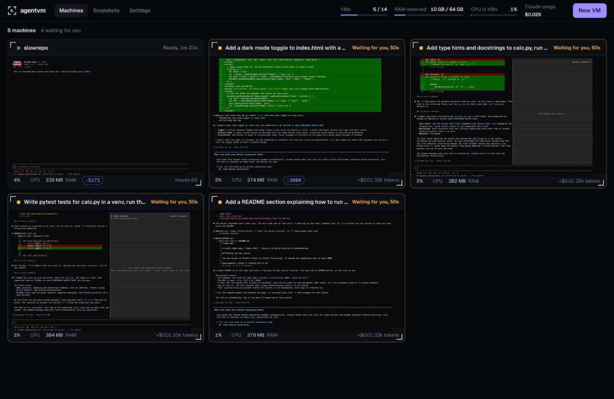
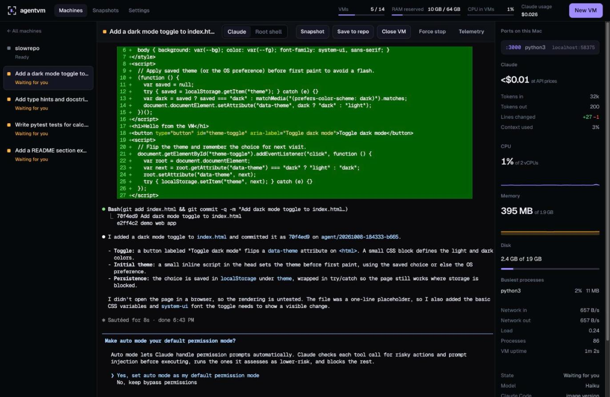
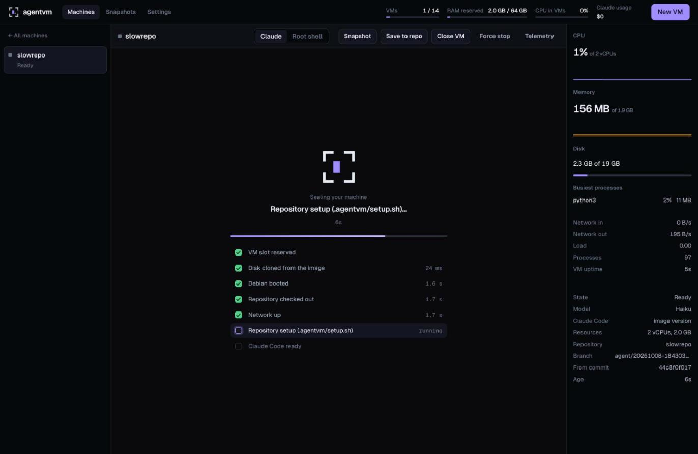
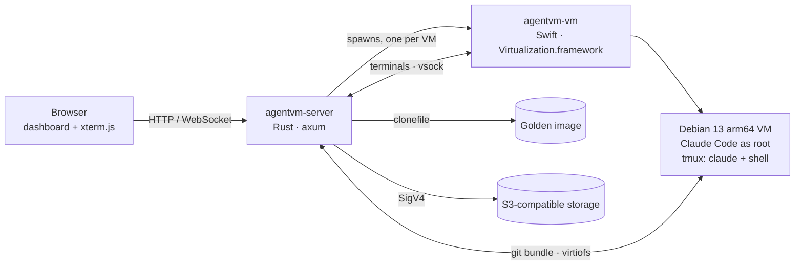

<p align="center">
  <picture>
    <source media="(prefers-color-scheme: dark)" srcset="docs/assets/logo-dark.svg">
    
  </picture>
</p>

<h1 align="center">agentvm</h1>

<p align="center">
  <b>Every terminal is a sealed machine.</b><br>
  Run many Claude Code agents in parallel, each in its own disposable Linux VM on Apple Silicon,<br>
  with full root inside and nothing touching your Mac.
</p>

<p align="center">
  <a href="https://github.com/egeominotti/agentvm/actions/workflows/ci.yml"></a>
  
  
  
  
</p>

<p align="center">
  <a href="#quick-start">Quick start</a> ·
  <a href="#features">Features</a> ·
  <a href="#how-it-works">How it works</a> ·
  <a href="#security-model">Security</a> ·
  <a href="#http-api">API</a> ·
  <a href="#development">Development</a>
</p>

<p align="center">
  
</p>

---

## Why agentvm

Claude Code is at its best when it can act on its own: install packages, run builds, break
things and fix them. Doing that on your own machine is a risk, and running several agents side by
side means fighting over ports, dependencies and files.

agentvm gives every agent its own **real Debian 13 virtual machine**, booted in about three
seconds with Apple's Virtualization.framework, on a fresh clone of your repository. Claude runs
as **root with every permission** inside it. When the work is done it comes back to your
repository as a git branch, and the VM is thrown away.

- **Full autonomy, zero risk.** Whatever happens inside the VM stays there. Your Mac and your
  working tree are never touched.
- **Real parallelism.** Ten tasks, ten machines, no shared state.
- **You stay in the loop.** Every agent is a live terminal in the browser: watch, type, interrupt,
  open a root shell next to it.
- **Nothing to install on the host.** Toolchains and dependencies live only inside the VMs.

## Features

| | |
|---|---|
| **Live terminal wall** | Every VM on one screen, with Claude Code running in it, CPU and memory sparklines and Claude's cost. Amber means an agent is waiting for you; desktop notifications tell you when you are elsewhere. |
| **Claude Code, unrestricted** | Interactive Claude Code as root (`--dangerously-skip-permissions`, `bypassPermissions` by default, no prompts), plus a root shell on the same checkout. Pick the model and the exact Claude Code version per launch. |
| **Per-VM resources** | Choose vCPUs and memory for every launch; the dashboard shows how many more VMs fit in free memory. |
| **Work returns as git branches** | *Save to repo* turns the current state into commits on `agent/<id>` in your repository, without stopping anything. Ready-to-copy `git switch` / `git merge` commands and a per-file diff. |
| **Snapshots, manual and automatic** | Freeze a whole running VM (files, packages, Claude's conversation) in under a second and restore it into a new machine where Claude continues the conversation. Automatic snapshots on a schedule (per machine if you like), the newest few kept, plus one just before closing. |
| **Backups anywhere** | Download snapshots as `.tar.zst`, import them on another Mac, or back them up to any S3-compatible storage: AWS S3, Cloudflare R2, Hetzner Object Storage, Backblaze B2, MinIO, RustFS. Multipart uploads up to ~640 GB. |
| **Survives restarts** | VMs keep running when the server restarts; the new server re-attaches to them and picks up where it left off. |
| **Every VM has its own ports** | Web services get their own name, `http://3000.<vm>.localhost:7777`, so every VM can serve port 3000 at once (HTTP and WebSocket, hot reload included). Databases and other TCP services get a direct port on `127.0.0.1`. Works even when they bind to the VM's localhost. |
| **A browser for Claude** | Headless Chromium and the Playwright MCP server are preinstalled and registered: Claude can open the app it is building and check it. |
| **Terminals like a real one** | Drag to copy to the Mac's clipboard, ⌘V to paste, drop files on a terminal to copy them into the VM (their paths are typed for you). |
| **Per-repo setup** | `.agentvm/setup.sh` runs before Claude starts: install dependencies, seed a database, start a dev server. |
| **Telemetry** | Per VM: CPU, memory, disk, network, busiest processes, uptime. Per agent: cost at API prices, tokens in/out, lines changed, context used. |
| **Settings, applied live** | VMs at once, vCPUs, memory, default model, time limits, Claude token (Keychain), VM image rebuilds with a chosen Claude Code version, S3, storage cleanup. |

## Quick start

**Requirements:** a Mac with Apple Silicon and a recent macOS, Xcode Command Line Tools
(`swiftc`), a Rust toolchain, and a Claude subscription. No Apple Developer account is needed:
the VM helper is ad-hoc signed with the `com.apple.security.virtualization` entitlement.

```bash
git clone https://github.com/egeominotti/agentvm.git && cd agentvm

scripts/build.sh           # bin/agentvm-vm (Swift, signed) + bin/agentvm-server (Rust)
scripts/build-golden.sh    # once, ~2 min: Debian 13 image with Claude Code preinstalled

claude setup-token         # once: a long-lived token for your Claude subscription
security add-generic-password -U -s agentvm -a agentvm -w    # paste it (or use Settings later)

bin/agentvm-server         # → http://127.0.0.1:7777
```

Open **http://127.0.0.1:7777**, press **New VM** (⌘K), pick a repository and, optionally, a first
task. A few seconds later Claude Code is running in its own machine.

## Using it

1. **New VM** (⌘K): repository, first task, model, Claude Code version, vCPUs and memory.
   *One VM per line* launches a machine for every line of the task.
2. **Machines** shows every VM live. Click one to work in it: Claude Code full size, a **Root
   shell** on the same checkout (`/root/work`), and the telemetry panel. Reloading the page keeps
   the sessions alive. Drag to copy, ⌘V to paste, drop files to copy them into the VM.
   Web services running in the VM appear in the bar under the toolbar.
3. **Save to repo** imports the work as commits on `agent/<id>`. **Snapshot** saves the whole VM.
   **Close VM** saves and destroys it; **Force stop** powers it off without saving.
4. **Snapshots** lists saved machines: restore, download, back up to S3, or bring a backup back
   from the bucket.

### Trying S3 backups locally

```bash
scripts/dev-s3.sh up       # RustFS in Docker: S3 on http://127.0.0.1:9100, console on :9101
```

It prints the values to paste in **Settings → Backups to S3** (provider *Local*).

## A closer look

<table>
  <tr>
    <td width="50%"></td>
    <td width="50%"></td>
  </tr>
  <tr>
    <td>A machine: Claude Code at work, its telemetry, Claude's cost and a dev server reachable on <code>localhost</code>.</td>
    <td>The boot sequence, built from real events: disk clone in milliseconds, Debian up in under two seconds.</td>
  </tr>
</table>

## How it works



- **Golden image.** `build-golden.sh` turns the official `debian-13-genericcloud-arm64` image
  into a ready machine: Claude Code, git, build tools, Python, Node, Chromium, tmux, no cloud-init
  at runtime. Each VM starts from an instant copy-on-write clone (APFS `clonefile`). The guest
  scripts come from the server at every launch, so upgrading agentvm needs no new image.
- **arm64 only.** Native on Apple Silicon end to end: no Rosetta on the Mac or in the VMs.
- **One process per VM.** The Swift helper owns a single VM, runs in its own session and writes
  its events to a file, so a crashing VM never takes the server down and the server can restart
  without stopping VMs.
- **No network between Mac and VM for control.** The repository goes in and comes back as a
  `git bundle` through a per-VM virtiofs folder; terminals travel over vsock to a PTY server in
  the guest.
- **Hooks and status line.** Claude Code hooks report when the agent works or waits; its status
  line reports cost and tokens. A tiny collector reads `/proc` for VM telemetry.

## Performance

Measured on an M5 Max (18 cores, 64 GB):

| | |
|---|---|
| Clone a VM disk from the golden image | ~10 ms |
| VM power-on → guest ready (repo cloned, network up) | ~3 s |
| Keystroke echo through the VM terminal | 0.12 ms median, 1.4 ms p95 |
| Snapshot of a running VM | < 1 s |
| Snapshot archive (3 GB used on disk) | ~600 MB, ~1 s to compress |
| 2000 synchronous 4 KB writes inside a VM | 0.6 s (guest flushes are a plain fsync) |
| Launching more VMs on the same repository | the repository is packed once and shared |
| Idle VM (60 s without work) | gives back all but its used memory + 1 GB to the Mac |
| Small task end to end ("create a file and commit") | 12–20 s, mostly Claude thinking |

By default agentvm runs as many VMs at once as fit in RAM, keeping 8 GB for macOS (14 VMs of
4 GB on a 64 GB Mac); extra launches wait in a queue.

## Security model

- **The VM is the sandbox.** Inside it Claude is root with every permission (`IS_SANDBOX=1`).
  A VM sees only its own job folder; your real checkout never enters it.
- **The Claude token** is read from the macOS Keychain and handed to Claude on a file
  descriptor (never in the environment of the commands it runs) and redacted from logs. Be aware
  that in a terminal VM the token stays in the VM while it runs and everything there is root:
  any code in the VM (including `.agentvm/setup.sh` and what the agent downloads) could read it.
  Only restore snapshots you trust, for the same reason.
- **The S3 secret key** lives in the Keychain and reaches `curl` on stdin, never on a command line.
- **Local only.** The dashboard binds to `127.0.0.1` and rejects requests whose `Host` or
  `Origin` is not local, so other websites cannot reach the API or the terminals (DNS rebinding,
  cross-site WebSockets). The dashboard cannot be framed by other sites.
- **The guest cannot reach the Mac through the shared folder.** The host never follows a symlink
  or blocks on a FIFO the guest planted there, and caps what it reads.
- One server instance per data folder, enforced with a lock. VMs reach the internet through NAT.

## Configuration

Settings are edited in the dashboard and saved in `~/AgentVMs/settings.json`. Environment
variables provide the defaults:

| Variable | Default | Meaning |
|---|---|---|
| `AGENTVM_PORT` | `7777` | Dashboard port (always on 127.0.0.1) |
| `AGENTVM_HOME` | `~/AgentVMs` | Images, golden disk, jobs, snapshots |
| `AGENTVM_CONCURRENCY` | fits in RAM | VMs running at once |
| `AGENTVM_CPUS` / `AGENTVM_MEMORY_MB` | `4` / `4096` | Default resources per VM |
| `AGENTVM_TIMEOUT_S` | `1800` | Time limit for automatic (non-interactive) tasks |
| `AGENTVM_S3_SECRET` | — | S3 secret key, overriding the Keychain (CI) |

## HTTP API

Everything the dashboard does is available over a local JSON API.

| Method | Path | |
|---|---|---|
| `POST` | `/api/tasks` | Launch: `{repo_path, prompt?, interactive?, model?, claude_version?, cpus?, memory_mb?}` |
| `GET` | `/api/tasks`, `/api/tasks/{id}` | Tasks with state, activity, telemetry and usage |
| `GET` | `/api/tasks/{id}/pty?session=claude\|shell` | WebSocket to a terminal in the VM |
| `POST` | `/api/tasks/{id}/save` · `/close` · `/stop` · `/snapshot` | Act on a running VM |
| `GET` | `/api/tasks/{id}/diff` · `/events` | Branch diff · server-sent events |
| `POST` | `/api/tasks/{id}/upload` | Copy a file into the VM (`x-file-name` header, raw body) |
| `PUT` | `/api/tasks/{id}/auto-snapshots` | This machine's snapshot interval: `{every_min}` or `null` |
| `GET` | `/api/snapshots` | Local snapshots |
| `POST` | `/api/snapshots/{id}/restore` · `/backup` | New VM from a snapshot · upload to S3 |
| `GET`/`POST` | `/api/snapshots/{id}/export` · `/api/snapshots/import` | Download / upload an archive |
| `GET`/`POST`/`DELETE` | `/api/backups`, `/api/backups/{id}/restore`, `/api/backups/{id}` | Snapshots in S3 |
| `GET`/`PUT` | `/api/settings`, `/api/settings/token`, `/api/settings/s3` | Settings, Claude token, S3 |
| `GET` | `/api/status`, `/api/golden`, `/api/claude/versions` | Host, VM image, Claude Code releases |

Non-interactive tasks (`interactive: false`) run `claude -p` to completion and return a branch,
which is handy for scripting.

## Development

```
server/      Rust: domain (pure) → app (use cases) → http, plus adapters for git, VMs, PTY,
             Keychain, S3, archives; the dashboard (vanilla JS, xterm.js) is embedded
vm-helper/   Swift: one VM per process, vsock bridge for terminals
guest/       Golden image setup, plus the job runner, PTY server, Claude wrapper, status line
             and telemetry collector that the server ships to every VM at launch
scripts/     build.sh, build-golden.sh, dev-s3.sh, test.sh (all test binaries in parallel)
dev/s3/      docker-compose.yml with RustFS for local S3
docs/        Design specs and implementation plan
```

**Tests never use mocks.** They run against real git repositories, files, a real Keychain, real
VMs, real Claude and a real S3 server. An architecture test enforces the layering: `http` never
touches adapters, the domain does no I/O, adapters do not know each other.

```bash
scripts/test.sh               # domain, adapters, app, HTTP, architecture (all in parallel)
scripts/dev-s3.sh up
scripts/test.sh --ignored     # real VMs, Claude and S3
```

CI runs formatting, clippy, the tests that need no VM, the Swift build and script checks on every
push. GitHub's macOS runners cannot nest virtualization, so VM tests run locally.

## Contributing

See [CONTRIBUTING.md](CONTRIBUTING.md). Security reports: [SECURITY.md](SECURITY.md).
Release notes: [CHANGELOG.md](CHANGELOG.md).

## Roadmap

- Native macOS app: start with a double-click or at login, no terminal needed.

## Acknowledgements

[xterm.js](https://xtermjs.org) (MIT) and the [Geist](https://vercel.com/font) fonts (SIL OFL 1.1)
are bundled under `server/src/http/web/vendor/`; the dashboard loads nothing from the internet.
Local S3 testing uses [RustFS](https://github.com/rustfs/rustfs).
