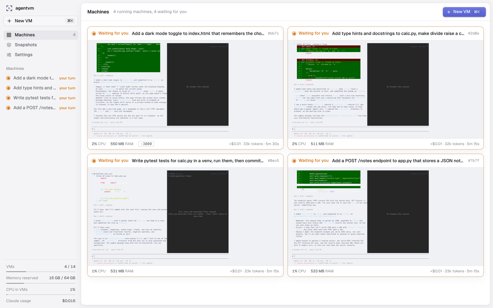
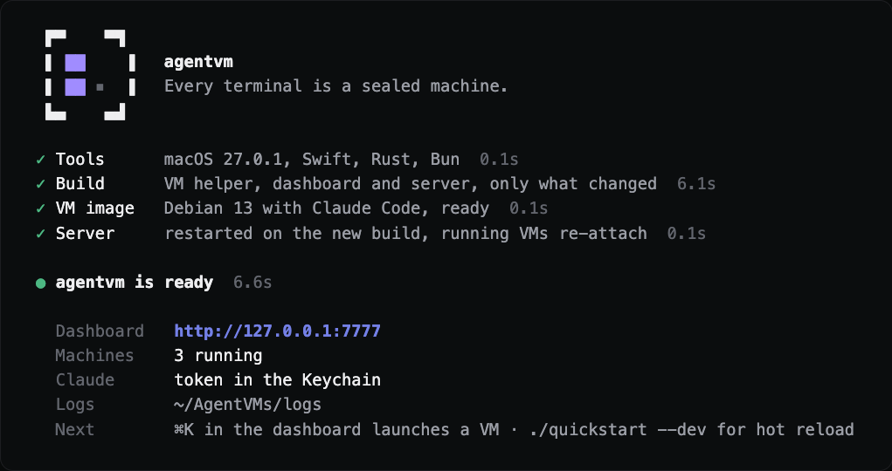
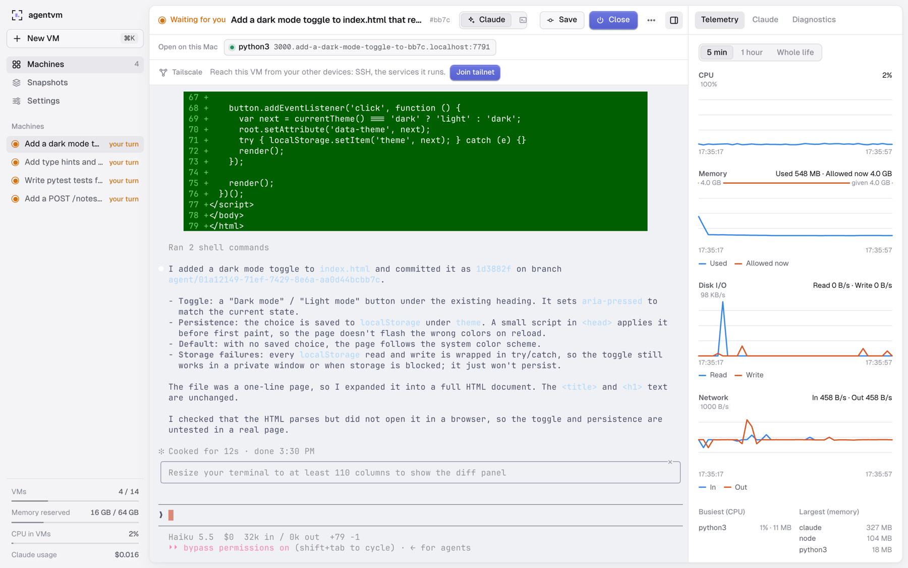
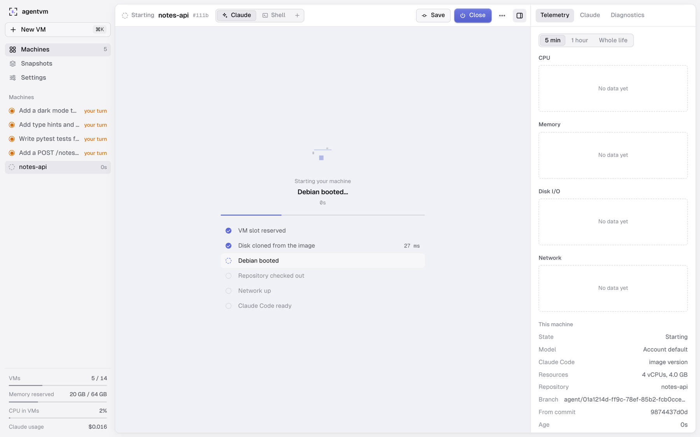
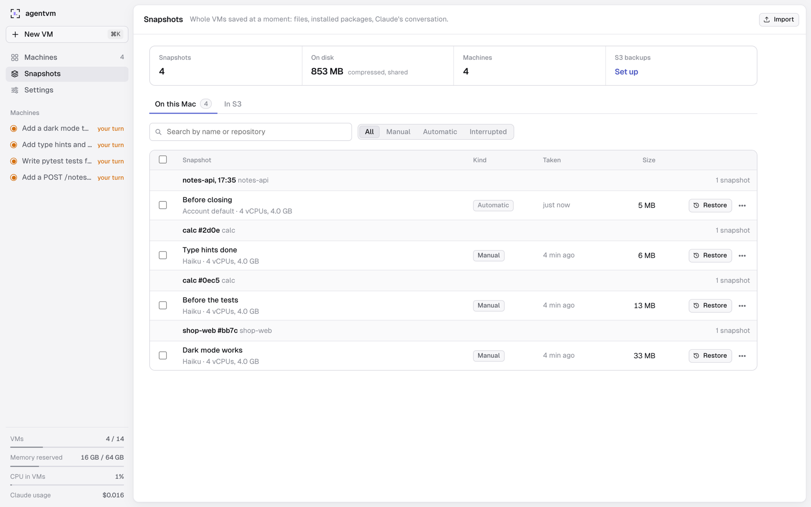
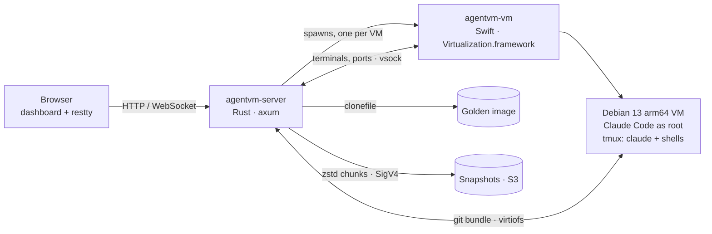
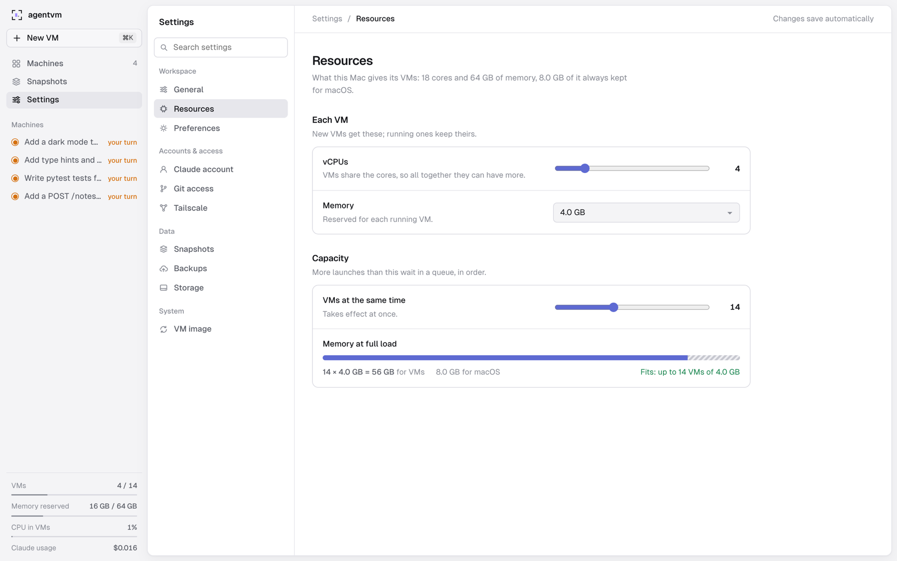

<div align="center">

<picture>
  <source media="(prefers-color-scheme: dark)" srcset="docs/assets/logo-dark.svg">
  
</picture>

<h1>agentvm</h1>

**Every terminal is a sealed machine.**<br>
Run Claude Code agents in parallel on your Mac, each in its own disposable Debian VM.

[](https://github.com/egeominotti/agentvm/actions/workflows/ci.yml)


[Quickstart](#quickstart) · [Usage](#usage) · [How it works](#how-it-works) · [Security](#security) · [Development](#development)

</div>

agentvm gives every Claude Code agent its own Debian 13 virtual machine on Apple's
Virtualization.framework, ready about 2 seconds after you press **New VM**. Inside, Claude runs as
root with every permission: it can install packages, start servers and break things without
touching your files or your checkout. You watch and drive every VM from a dashboard at
`http://127.0.0.1:7777`. When the work is done, it comes back to your repository as commits on an
`agent/<id>` branch, and the VM is thrown away.

```bash
git clone https://github.com/egeominotti/agentvm.git && cd agentvm && ./quickstart
```

One command builds everything, makes the VM image the first time (about 2 minutes, once) and
opens the dashboard. Then paste a Claude token (`claude setup-token`) in **Settings › Claude
account** and press **New VM**. Needs a Mac with Apple silicon, Xcode Command Line Tools,
[Rust](https://rustup.rs) and [Bun](https://bun.sh); details in [Quickstart](#quickstart).

<p align="center">
  
</p>
<p align="center"><i>The Machines wall: four agents, four VMs, one screen.</i></p>

## Highlights

- **Ready in ~2 s.** Each VM boots from a copy-on-write clone of a prebuilt image, so a new machine
  costs milliseconds of disk work and about a second of Linux boot.
- **Claude unrestricted, your files out of reach.** Claude Code runs as root with
  `--dangerously-skip-permissions`. The VM sees only its own job folder; your checkout never enters
  it.
- **Real terminals in the browser.** Ghostty's core (libghostty-vt, through
  [restty](https://github.com/wiedymi/restty)) on WebGPU, with xterm.js as the fallback. Claude plus
  up to nine shells per VM, in Catppuccin Mocha or Latte to match light and dark mode.
- **A folder or a git link.** `github.com/owner/repo`, `owner/repo`, https or ssh, any host.
  agentvm tells you whether a link is public or private before launching, and lets you pick the
  branch.
- **Work comes back as a branch.** Save copies the VM's commits to `agent/<id>` in your repository
  while it keeps running; push that branch to origin from the dashboard.
- **Snapshots, compressed and deduplicated.** Freeze a running VM by hand or on a schedule. Disks
  are stored as 1 MiB zstd-19 chunks shared by every snapshot: six real snapshots take 1.19 GB
  instead of ~20 GB. Restore, export, import, or back up to any S3-compatible storage.
- **Tailscale in every VM.** One button joins a VM to your tailnet as `agent-<its id>`, an
  ephemeral node with Tailscale SSH, reachable from all your devices.
- **Every VM has its own ports.** `http://3000.<vm>.localhost:7777` reaches port 3000 of that VM,
  so all your VMs can serve port 3000 at once.
- **Live telemetry.** CPU, memory, disk, network and processes per VM, plus Claude's conversation,
  cost and tokens, kept after the VM is closed.
- **Secrets in the Keychain.** The Claude token, git tokens, the S3 key and the Tailscale key are
  kept in the macOS Keychain and never put on a command line, in a URL or in a log.
- **Survives restarts.** VMs keep running when the server restarts; the new server re-attaches.

## Requirements

- A Mac with Apple silicon and a recent macOS.
- Xcode Command Line Tools (`swiftc`), [Rust](https://rustup.rs) and [Bun](https://bun.sh).
- A Claude subscription.

No Apple Developer account is needed: the VM helper is ad-hoc signed with the
`com.apple.security.virtualization` entitlement.

## Quickstart

```bash
git clone https://github.com/egeominotti/agentvm.git
cd agentvm
./quickstart
```

`./quickstart` checks the tools, builds only what changed, builds the VM image the first time
(about 2 minutes, once), starts the server and opens the dashboard. Run it again after every
`git pull`: when nothing changed it takes about a second, and running VMs re-attach to the new
server.

Then save your Claude token once: create it with `claude setup-token` and paste it in
**Settings › Claude account**. It goes to the macOS Keychain.

```bash
./quickstart            # build, start, open http://127.0.0.1:7777
./quickstart --dev      # the same, plus the dashboard with hot reload (Vite) on :5173
./quickstart --no-open  # do not open the browser
```

<p align="center">
  
</p>

<details>
<summary>The same, step by step</summary>

```bash
scripts/build.sh           # bin/agentvm-vm (Swift, signed) + bin/agentvm-server (Rust), incremental
scripts/build-golden.sh    # once, ~2 min: the Debian 13 image with Claude Code

claude setup-token         # once: a long-lived token for your Claude subscription
security add-generic-password -U -s agentvm -a agentvm -w    # paste it (or use Settings later)

bin/agentvm-server         # http://127.0.0.1:7777
```

</details>

## Usage

### Launch a VM

Press **New VM** (⌘K) and give it a repository: a folder on your Mac, or a link.

```text
github.com/owner/repo
owner/repo
https://gitlab.com/group/repo.git
git@github.com:owner/repo.git
```

A link is cloned once into `~/AgentVMs/repos` and fetched before every launch. Private
repositories open with your Mac's own git access (ssh key, `gh`) or a token saved per host in
**Settings › Git access**, used on the Mac only. Pick the branch, the model, the Claude Code
version, vCPUs and memory. Claude Code starts in the VM's terminal on a fresh checkout in
`/root/work`.

If the repository has a `.agentvm/setup.sh`, it runs as root in the checkout before Claude starts.
What it creates (installed dependencies, build output) stays out of the agent's commits.

```bash
# .agentvm/setup.sh
npm ci
python3 -m venv .venv && .venv/bin/pip install -r requirements.txt
```

### Work in it

Every VM has a **Claude** tab and a **Shell** tab; **+** opens more shells, up to Shell 9, each a
tmux session of its own. Reloading the page keeps them. Drag to copy to the Mac's clipboard,
⌘V to paste, drop files on a terminal to copy them into the VM. The shell is zsh with starship,
zoxide, fzf, eza, bat and lazygit. Headless Chromium and the Playwright MCP server are installed,
so Claude can open the app it is building.

Web services running in the VM appear in a bar on its page, each at its own name:

```text
http://3000.<vm>.localhost:7777     HTTP and WebSocket, hot reload included
```

Other TCP services (databases) get a direct port on `127.0.0.1`. Both work even when the service
listens only on the VM's localhost.

<table>
  <tr>
    <td width="50%"></td>
    <td width="50%"></td>
  </tr>
  <tr>
    <td>A machine: Claude Code's work, its telemetry, a dev server on port 3000 open on the Mac, Tailscale one click away.</td>
    <td>The boot sequence, built from real events with their timings.</td>
  </tr>
</table>

### Bring the work back

**Save** commits whatever the agent left uncommitted and copies the VM's commits to
`agent/<id>` in your repository. The VM keeps running. **Close** saves, then shuts the VM down.

```bash
git switch agent/<id>     # look at it
git merge agent/<id>      # take it
```

**⋯ › Push branch to origin** pushes it (never forced) and links to its pull request on GitHub
or GitLab. **Force stop** powers a VM off at once and keeps its disk as a snapshot you can resume.

### Snapshots

**⋯ › Take a snapshot now** freezes the whole VM: files, packages, Claude's conversation.
Automatic snapshots run every 30 minutes by default, keep the newest 4 per VM, and take one more
just before a VM closes; the interval can be set per machine. The **Snapshots** page restores any
of them into a new VM, where Claude continues its last conversation, downloads it as `.tar.zst`,
imports one from another Mac, or backs it up to S3: AWS S3, Cloudflare R2, Hetzner Object Storage,
Backblaze B2, MinIO or RustFS.

```bash
scripts/dev-s3.sh up    # try backups locally: RustFS in Docker on http://127.0.0.1:9100
```

<p align="center">
  
</p>
<p align="center"><i>Four snapshots of four machines take 853 MB on disk in all: each adds only what changed, 5 to 33 MB.</i></p>

### Tailscale

Put a VM on your tailnet and reach it from your laptop or phone: `ssh root@agent-<id>`, or the
services it runs.

1. In Tailscale, **Settings › Keys › Generate auth key** with **Reusable** on (and
   **Pre-approved** if your tailnet approves new devices).
2. On a VM's page, paste it and press **Save and join**. It goes to the Keychain, once, for every
   VM; from then on **Join tailnet** is one click.

The VM joins in about 2 seconds as `agent-<its UUIDv7>`, a name no other VM shares, and shows its
MagicDNS name, its address and the `ssh` command to copy. **Leave** takes it off the tailnet at
once; joining again is instant, under the same name. Every VM is an ephemeral node whose state
lives only in memory: it logs out when the VM ends, and a snapshot never carries an identity.
**Settings › Tailscale** can make every new VM join, turn Tailscale SSH off (on by default) and set
ACL tags. Tailscale's connectivity logging is off.

### HTTP API

Everything the dashboard does goes through a local JSON API. A task without a terminal runs
`claude -p` to completion and leaves a branch, which is handy for scripts:

```bash
curl -s http://127.0.0.1:7777/api/tasks \
  -H 'content-type: application/json' \
  -d '{"repo_path": "github.com/owner/repo", "prompt": "Make the failing test in parser.rs pass"}'
# {"id":"…"}

curl -s http://127.0.0.1:7777/api/tasks/<id>    # state, branch, telemetry, usage
```

Every route is listed in [`server/src/http/router.rs`](server/src/http/router.rs).

## How it works



- **Golden image.** `scripts/build-golden.sh` turns Debian's official
  `debian-13-genericcloud-arm64` image into a ready machine: Claude Code, git, build tools, Python,
  Node, Chromium, tmux, zsh, Tailscale (off until a VM joins). Each VM starts from an APFS
  `clonefile` of it. The scripts that run in the guest come from the server at every launch, so
  most upgrades need no new image.
- **One process per VM.** A small Swift helper owns a single VM and writes its events to a file,
  so a crashing VM never takes the server down and the server can restart without stopping VMs.
- **No network between Mac and VM for control.** The repository goes in and comes back as a
  `git bundle` through the VM's own virtiofs folder; terminals and forwarded ports travel over
  vsock.
- **Snapshots.** A snapshot is first an instant clone of the disk. A background compactor then
  splits it into 1 MiB chunks named by their BLAKE3 hash and compressed with zstd 19; chunks shared
  with other snapshots are stored once. A restore checks every chunk against its hash.
- **Memory.** By default agentvm runs as many VMs as fit in RAM, keeping 8 GB for macOS (14 VMs of
  4 GB on a 64 GB Mac), and starts one only when macOS reports the memory free. A VM idle for 60 s
  gives back everything but what it uses plus 1 GB.

### Performance

Measured on an M5 Max (18 cores, 64 GB):

| | |
|---|---|
| New VM → terminal ready | 2.0 s |
| Debian boot inside it | 1.05 s |
| Keystroke → echo, through the server and the VM | ~2 ms in zsh, 0.8 ms with `cat` |
| 20 MB colored log in the terminal (Chrome) | 105 ms with restty, 226 ms with xterm.js |
| Six real snapshots on disk | 1.19 GB as shared chunks, ~20 GB as clones |
| Disk data compressed with zstd 19 | 3.35 GB → 0.91 GB (4.1x) |

## Security

- **The VM is the sandbox.** Claude is root inside it (`IS_SANDBOX=1`). The VM sees only its job
  folder; it has outbound internet through NAT, so treat what an agent downloads as untrusted.
- **Secrets live in the macOS Keychain.** Git tokens and the S3 key never leave the Mac: git gets
  its token through a credential helper, `curl` gets the S3 key on stdin.
- **Two secrets do enter a VM, because it needs them.** The Claude token and, if the VM joins a
  tailnet, the Tailscale auth key each arrive once as a `0600` file in the VM's job folder, which
  the guest reads and deletes. Claude gets its token on a file descriptor, never in the
  environment of the commands it runs. In a terminal VM the token is kept in a root-only file
  under `/run` while the VM runs, so any code in the VM (including `.agentvm/setup.sh`) could read
  it. Only restore snapshots you trust, for the same reason.
- **Local only.** The dashboard and every forwarded port listen on `127.0.0.1`. Requests whose
  `Host` or `Origin` is not local are rejected (DNS rebinding, cross-site WebSockets), and the
  dashboard cannot be framed by other sites.

Report vulnerabilities privately, as described in [SECURITY.md](SECURITY.md).

## Configuration

Settings are edited in the dashboard and saved in `~/AgentVMs/settings.json`.

<p align="center">
  
</p>

Environment variables set the defaults:

| Variable | Default | |
|---|---|---|
| `AGENTVM_PORT` | `7777` | Dashboard port, always on `127.0.0.1` |
| `AGENTVM_HOME` | `~/AgentVMs` | Image, jobs, snapshots, logs |
| `AGENTVM_CONCURRENCY` | fits in RAM | VMs running at once; more launches wait in a queue |
| `AGENTVM_CPUS` / `AGENTVM_MEMORY_MB` | `4` / `4096` | Resources per VM |
| `AGENTVM_TIMEOUT_S` | `1800` | Time limit for tasks without a terminal |
| `AGENTVM_MIN_FREE_GB` | `10` | Free disk below which launches, snapshots and imports are refused |
| `AGENTVM_LOG` | `info` | Log level; JSON logs in `~/AgentVMs/logs`, 14 days kept |

## Development

```text
server/     Rust: domain (pure) → app (use cases) → http, plus adapters for git, VMs, PTY,
            Keychain, S3. Embeds the dashboard's build.
web/        Dashboard: React, TypeScript, Vite, built with Bun. API types generated from Rust.
vm-helper/  Swift: one process per VM, plus the vsock bridge for terminals.
guest/      Scripts that run inside the VMs.
scripts/    build.sh, test.sh, sandbox.sh, build-golden.sh, dev-s3.sh, vm-run.ts.
```

```bash
./quickstart --dev          # server + dashboard with hot reload on :5173
scripts/test.sh             # dashboard, domain, adapters, app, HTTP, architecture (~30 s)
scripts/test.sh --ignored   # plus real VMs, Claude and S3 (~3 min, uses your Claude quota)
scripts/sandbox.sh 7791     # a second agentvm with its own home and port, for trying changes
```

Tests never use mocks: they run against real git repositories, files, the Keychain, VMs, Claude
and an S3 server. An architecture test keeps the layers apart and every file under 300 lines. CI
runs everything that needs no VM; GitHub's macOS runners cannot nest virtualization, so VM tests
run locally.

Start with [AGENTS.md](AGENTS.md) (how to work on the repository, for people and agents alike) and
[CONTRIBUTING.md](CONTRIBUTING.md) (what a change needs to be merged). Changes are listed in
[CHANGELOG.md](CHANGELOG.md).

## Status

agentvm is young and changes fast. There are no tagged releases yet: run it from source with
`./quickstart`. Next on the roadmap is a native macOS app that starts with a double-click or at
login.

## Acknowledgements

The dashboard bundles [restty](https://github.com/wiedymi/restty) with
[libghostty-vt](https://ghostty.org), [xterm.js](https://xtermjs.org), [React](https://react.dev),
[TanStack Query](https://tanstack.com/query) and [Radix UI](https://www.radix-ui.com) (all MIT),
and the [JetBrains Mono Nerd Font](https://www.nerdfonts.com), [Noto Sans
Symbols](https://github.com/notofonts/symbols) and [Geist](https://vercel.com/font) fonts (SIL
OFL 1.1); it loads nothing from the internet. Terminal colors are
[Catppuccin](https://catppuccin.com). Local S3 testing uses
[RustFS](https://github.com/rustfs/rustfs).

## License

This repository does not include a license yet.
